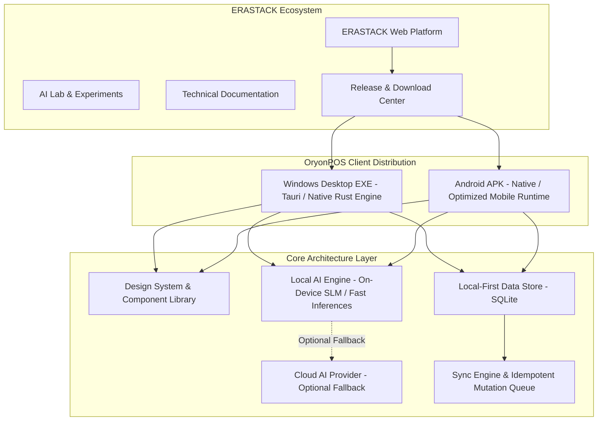

# ERASTACK Product Requirements Document (PRD)

> **Status:** Draft / Foundation Baseline  
> **Versi:** 1.0.0  
> **Tanggal Pembaruan:** 20 Agustus 2026  
> **Klasifikasi:** Internal Engineering & Product Source of Truth  
> **Pemilik Produk:** Principal Product Engineer & Technical Product Manager  

---

## 1. Product Overview

**ERASTACK** adalah platform teknologi terintegrasi (*Software Platform + AI Engineering Hub + Product Ecosystem*) yang dirancang sebagai ekosistem sentral bagi perangkat lunak, sistem kecerdasan buatan (*AI-ready applications*), aplikasi bisnis operasional (*offline-first business applications*), distribusi rilis desktop (Windows EXE) dan mobile (Android APK), eksplorasi laboratorium AI (*AI Lab*), serta dokumentasi teknis kelas produksi.

ERASTACK bukan sekadar portofolio developer statis atau landing page distribusi download biasa. Platform ini mengusung arsitektur rekayasa modern yang mengedepankan performa tinggi (*lightweight*), kedaulatan data (*local-first*), ketangguhan tanpa jaringan (*offline-first*), serta integrasi model komputasi cerdas lokal (*on-device Local AI*).

Sebagai produk peluncuran utama dalam ekosistem ini, platform akan menginkubasi dan mendistribusikan **OryonPOS**—sebuah aplikasi Point of Sale & Business Management mutakhir yang beroperasi secara mandiri tanpa ketergantungan internet, dilengkapi asisten analitik AI lokal serta opsi sinkronisasi awan (*Cloud Sync*) bertahap.

---

## 2. Product Vision

Menjadikan **ERASTACK** sebagai standar ekosistem perangkat lunak generasi baru yang menggabungkan kesederhanaan (*lightweight & minimalist*), ketangguhan operasional tanpa koneksi (*true offline-first*), dan kecerdasan komputasi lokal (*Local AI on edge*) untuk menghasilkan produk teknologi yang cepat, aman, dan berkelanjutan.

---

## 3. Product Mission

1. **Membangun Hub Rekayasa Produk:** Menyediakan platform terpadu untuk mendokumentasikan, menampilkan, dan mendistribusikan perangkat lunak kelas produksi dengan standar arsitektur tinggi.
2. **Menegakkan Kedaulatan Data & Offline-First:** Mengeliminasi ketergantungan mutlak terhadap jaringan cloud untuk operasi bisnis primer melalui arsitektur *local database* dan *on-device processing*.
3. **Mendemokratisasi Local AI:** Mengintegrasikan kapabilitas Large Language Model (LLM) dan Small Language Model (SLM) langsung di perangkat pengguna secara privat, aman, dan tanpa biaya komputasi awan yang membengkak.
4. **Menghadirkan Solusi Bisnis Tangguh (OryonPOS):** Mengembangkan aplikasi kasir dan inventaris yang zero-latency, anti-downtime, dan ramah bagi pelaku usaha dari skala mikro hingga enterprise.
5. **Menjaga Efisiensi Sumber Daya:** Memastikan seluruh artefak software memiliki footprint minimal, penggunaan memori/CPU rendah, dan kecepatan eksekusi tinggi.

---

## 4. Problem Statement

1. **Ketergantungan Berlebih pada Cloud (Cloud Fragility):** Banyak aplikasi SaaS modern mewajibkan koneksi internet konstan. Ketika jaringan down atau server mengalami gangguan, operasional kasir dan pencatatan transaksi terhenti seketika.
2. **Latensi dan Overhead Software Berat (Software Bloat):** Perkembangan software saat ini sering dibebani pustaka raksasa, konsumsi RAM berlebih, dan waktu loading yang lambat, mengakibatkan pengalaman pengguna yang tersendat pada perangkat spesifikasi standar.
3. **Privasi & Biaya Token AI Cloud:** Mengirimkan seluruh data transaksi dan inventaris ke server pihak ketiga menimbulkan risiko kebocoran privasi data bisnis serta membebankan biaya API bulanan yang tidak terduga.
4. **Fragmentasi Distribusi & Portofolio Rekayasa:** Pengembang dan pengguna kesulitan menemukan satu portal terpercaya yang menyatukan dokumentasi arsitektur, rilis biner multi-platform (Windows & Android), changelog terverifikasi, dan showcase inovasi AI.

---

## 5. Goals

- Membangun web platform ERASTACK yang cepat, elegan, berestetika industrial modern, ramah SEO/AEO/GEO, dan responsif di seluruh perangkat.
- Menyediakan sistem manajemen rilis biner (*Download System*) yang aman dengan metadata komprehensif (SHA256 checksum, ukuran file, arsitektur CPU, dan catatan rilis).
- Merancang dan mendokumentasikan fondasi aplikasi **OryonPOS** (Point of Sale, Inventory Management, Dashboard Reporting, Local AI Assistant) berbasis SQLite lokal.
- Mengimplementasikan abstraksi AI terpadu (*Local AI Provider* & *Cloud AI Provider fallback*) dengan skema *Controlled Tool Calling* yang aman dan terisolasi.
- Menetapkan standar rekayasa *lightweight* tanpa kompromi (Fast FCP, bundle size minimal, zero memory leaks).

---

## 6. Non-Goals

- **Bukan Cloud-Only SaaS:** ERASTACK tidak akan memaksa pengguna mendaftar akun cloud atau terhubung ke server cloud hanya untuk menjalankan fungsi dasar aplikasi.
- **Bukan Bloated Web Application:** Tidak mengizinkan framework grafis 3D berat (seperti Three.js/WebGL penuh) atau dependensi raksasa jika utilitas native dan CSS modern dapat mencapainya.
- **Bukan Uncontrolled AI Playground:** Local AI tidak diberikan akses query raw SQL bebas ke database operasional.
- **Bukan E-Commerce Marketplace Umum:** Platform tidak berfungsi sebagai toko online pihak ketiga multi-vendor pada rilis awal, melainkan distribution hub resmi produk ERASTACK.

---

## 7. Target Users

1. **Pemilik Bisnis & Kasir (UMKM / Retail / F&B):** Membutuhkan POS andal yang tidak pernah macet saat mati lampu atau internet putus, cepat melayani antrean, dan menghitung laba otomatis.
2. **Software Engineers & AI Practitioners:** Mencari referensi arsitektur modern, membaca dokumentasi teknis mendalam, mengeksplorasi eksperimen AI Lab, serta menguji rilis platform.
3. **Technical Stakeholders & Evaluator Produk:** Meninjau kapabilitas ekosistem software ERASTACK, portofolio rekayasa, standar kepatuhan performa, dan stabilitas biner rilis.

---

## 8. User Personas

### Persona A: Budi Pratama (Retail Store Owner)
- **Karakteristik:** Memiliki 2 toko kelontong di area dengan sinyal seluler tidak stabil.
- **Kebutuhan:** Transaksi kasir secepat kilat (barcode scanning instan), stok terpotong otomatis, dan laporan laba bersih harian tanpa ribet internet.
- **Pain Point:** Sering kehilangan penjualan saat aplikasi kasir berbasis web loading berputar-putar ketika sinyal 4G hilang.

### Persona B: Sarah Danastri (Lead Product Architect / Tech Enthusiast)
- **Karakteristik:** Fokus pada arsitektur software bersih, offline-first sync, dan integrasi Small Language Model di perangkat edge.
- **Kebutuhan:** Akses mudah ke dokumentasi teknis ERASTACK, changelog terperinci, release binaries (Windows EXE / Android APK), serta AI Lab experiments.
- **Pain Point:** Frustrasi dengan portal produk yang minim dokumentasi teknis dan software yang memakan RAM lebih dari 1GB hanya untuk tugas sederhana.

---

## 9. Core User Problems & Solutions

| Masalah Utama Pengguna | Solusi ERASTACK / OryonPOS |
| :--- | :--- |
| Internet mati saat antrean kasir menumpuk | Arsitektur **Offline-First** + SQLite lokal murni; 0ms network latency |
| Biaya langganan cloud & API AI mahal | **Local AI Provider** (on-device SLM/heuristic tools) gratis biaya operasional awan |
| Keraguan keamanan & integritas file instalasi | **Download System** terverifikasi SHA-256, info arsitektur (x64, arm64), dan changelog lengkap |
| UI rumit dan membingungkan operator kasir | Desain **Ergonomis Industrial** dengan target sentuh presisi (Fitts's Law) & visual hierarchy jelas |

---

## 10. Product Principles

1. **Lightweight by Default:** Setiap baris kode, aset gambar, dan pustaka harus dihitung dampaknya terhadap bundle size dan konsumsi memori.
2. **Offline Resilience:** Fungsionalitas inti adalah hak mutlak di perangkat lokal; internet hanya akselerator sekunder.
3. **Zero-Latency Interactions:** Responsivitas antarmuka di bawah ambang batas persepsi manusia (*Doherty Threshold* < 400ms; target interaksi kasir < 100ms).
4. **Strict Isolation & Security:** AI berkomunikasi melalui kontrak fungsi terisolasi (*Tool Sandbox*); data finansial lokal terenkripsi.
5. **Technical Transparency:** Menyediakan dokumentasi terbuka, changelog akurat, dan pelacakan versi yang terstruktur rapi.

---

## 11. Platform Architecture Overview



---

## 12. Information Architecture (IA)

```
ERASTACK
│
├── 1. Home (Platform Manifesto, Ecosystem Highlights, Featured Apps, AI Lab Teaser, Metrics)
├── 2. Products (Product Catalog, OryonPOS Spotlight, Future Suite)
│     └── [Product Detail: /products/oryonpos]
├── 3. Apps (Web Apps, Desktop Suite, Mobile Suite)
├── 4. Downloads (Release Center, Windows EXE, Android APK, Checksums, Archive)
├── 5. Projects (Engineering Showcases, Open-Source Repositories, Case Studies)
├── 6. AI Lab (Interactive AI Experiments, Benchmarks, Local Model Playgrounds)
├── 7. Documentation (Getting Started, Architecture Guides, API Specs, Design Tokens)
├── 8. Releases (Version Log, Signed Binaries, Release Highlights)
├── 9. Changelog (Granular commit-level and release updates, Bug Fixes, Breaking Changes)
├── 10. About (Vision, Engineering Principles, Tech Stack, Roadmap, Contact)
└── 11. Command Center / Global Search (Cmd+K Universal Navigation & Tool Launcher)
```

---

## 13. Navigation System

- **Top Navigation Bar (Desktop):**
  - Brand identity (Logo ERASTACK + Tagline badge).
  - Primary links: *Products, Apps, Downloads, Projects, AI Lab, Docs*.
  - Utility controls: *Global Command Palette (Cmd+K / Ctrl+K), Theme Switcher (Dark/Light with Dark-first default), Version Status Tag*.
- **Mobile Navigation:**
  - Compact sticky top bar dengan burger menu animasi halus.
  - Full-screen sheet navigation dengan touch target $\ge 48\text{px}$.
  - Bottom quick-action bar untuk akses cepat ke *Downloads*, *Products*, dan *Search*.

---

## 14. Homepage Requirements

- **Hero Section:** Value proposition yang berani ("Software • AI • Engineering"), visualisasi interaktif ekosistem, direct CTA ke *Download OryonPOS* dan *Explore Documentation*.
- **Ecosystem Pillars Grid:** 4 pilar arsitektur (*Lightweight, Offline-First, Local AI, Cross-Platform*).
- **Featured Product Showcase:** Tampilan interaktif produk unggulan OryonPOS beserta live switch screenshot desktop & mobile.
- **AI Lab Interactive Preview:** Mini-demo komponen analitik atau benchmark inferensi lokal.
- **Engineering Metrics:** Metrik performa real (Bundle size, Startup time, RAM consumption).
- **Recent Releases Stream:** Feed biner rilis terbaru dengan tautan download langsung.

---

## 15. Products Directory

- Menampilkan seluruh katalog perangkat lunak resmi dari ERASTACK.
- Filter produk berdasarkan kategori: *Business / POS, Engineering Tools, AI Utilities, Developer Kits*.
- Indikator platform badge: `Windows`, `Android`, `Web`, `Linux (Future)`, `macOS (Future)`.
- Status kesiapan produk: `Production Ready`, `Public Beta`, `In AI Lab Incubator`.

---

## 16. Product Detail Specification (Contoh: OryonPOS)

- **Header:** Nama produk, logo, kategori, versi rilis terkini, badge kestabilan.
- **Live Interactive Preview / Screenshots:** Showcase layout POS kasir, manajemen stok, dan laporan AI.
- **Feature Matrix:** Tabel spesifikasi lengkap (fitur offline vs fitur opsional cloud).
- **Download Action Card:** Deteksi otomatis OS pengguna dengan tombol download utama + opsi rilis alternatif.
- **Technical Specs:** Persyaratan minimum perangkat keras (RAM min. 512MB, storage 50MB, OS requirements).
- **Release History & Changelog:** Log perubahan khusus produk.

---

## 17. Downloads Center

Sistem distribusi biner terpusat yang dirancang khusus untuk kenyamanan dan keamanan pengguna.

- Filter tab: `All Releases`, `Windows (.exe)`, `Android (.apk)`, `Archived Releases`.
- Informasi kartu download:
  - Nama file biner lengkap (e.g., `OryonPOS-Setup-v1.0.0-x64.exe`, `OryonPOS-v1.0.0-arm64-v8a.apk`).
  - Nomor versi semantik (`vX.Y.Z`).
  - Tanggal rilis resmi (ISO format).
  - Ukuran file presisi (e.g., `14.2 MB`).
  - Arsitektur CPU target (`x86_64`, `ARM64`, `Universal`).
  - Tombol **Copy SHA-256 Checksum** dengan feedback tooltip.
  - Tautan langsung ke Catatan Rilis (*Release Notes*).
- Verifikasi Integritas: Panduan visual 1-klik untuk memeriksa checksum via PowerShell / Terminal.

---

## 18. Projects Showcase

- Dokumentasi showcase proyek rekayasa internal, modul open-source, dan studi kasus sistem.
- Menampilkan arsitektur repositori, stack teknologi yang digunakan, serta metrik benchmark.
- Tautan repositori GitHub / internal mirror.

---

## 19. AI Lab

- Laboratorium inovasi dan sandbox eksperimental AI on-device.
- Demonstrasi Small Language Model (SLM) berbasis WebAssembly / ONNX Runtime / WebLLM.
- Komparasi performa inferensi real-time: *Local Token Generation Speed (tokens/sec)* vs *Cloud API Latency*.
- Playground interaktif untuk pengujian tool calling dan structured query parser.

---

## 20. Documentation (Docs Engine)

- Mesin dokumentasi teknis berbasis Markdown/MDX yang sangat cepat dan terindeks penuh.
- Struktur sidebar multi-level:
  - *Getting Started* (Instalasi, Quickstart).
  - *Core Concepts* (Offline-First Architecture, Local Database, Local AI System).
  - *OryonPOS Manual* (Kasir, Stok, Transaksi, Laporan, Troubleshooting).
  - *Engineering & API* (Database Schema, AI Tool Signatures, Sync Protocols).
  - *Design System* (Design Tokens, Component Guidelines).
- Fitur pendukung: Code copy button, inline syntax highlighter, breadcrumb navigasi, edit on GitHub link, dan integrasi search instan.

---

## 21. Releases Center

- Daftar riwayat rilis formal platform dan aplikasi.
- Filter berdasarkan produk dan tag kestabilan (`Stable`, `LTS`, `Beta`, `Nightly`).
- Integrasi penandatanganan digital (*Code Signing & Hash integrity*).

---

## 22. Changelog

- Catatan perubahan granuler yang diperbarui pada setiap rilis biner atau platform update.
- Standar klasifikasi entri:
  - `Added` (Fitur baru)
  - `Changed` (Perubahan fungsi eksisting)
  - `Fixed` (Perbaikan bug)
  - `Performance` (Peningkatan kecepatan dan efisiensi memori)
  - `Security` (Patch kerentanan)
  - `Deprecated / Removed` (Fitur usang)

---

## 24. Universal Search & Command Menu (Cmd+K)

- Modal pencarian instan berbasis keyboard shortcut (`Cmd+K` / `Ctrl+K`).
- Indeks pencarian lokal tanpa latensi server:
  - Navigasi halaman cepat.
  - Pencarian biner download langsung.
  - Pencarian artikel dokumentasi dan kode contoh.
  - Eksekusi aksi utilitas (ganti tema, copy download link).

---

## 25. Product Portfolio Architecture

Ekosistem ERASTACK dirancang untuk menampung ekspansi produk masa depan secara modular tanpa merombak arsitektur inti:
- **Suite 1 (Bisnis & Retail):** OryonPOS (Kasir, Inventaris, Laba Rugi).
- **Suite 2 (AI & Produktivitas):** Local AI Assistant, Voice Note Transcriber Lokal, AI Document Search.
- **Suite 3 (Developer & Engineering):** Local Database Inspector, Offline API Tester, Cross-Platform Deployment Tools.

---

## 26. Download System Specification

```
Download Item Data Structure:
{
  "id": "oryonpos-win-x64-v1.0.0",
  "productId": "oryonpos",
  "productName": "OryonPOS",
  "platform": "windows",
  "extension": ".exe",
  "version": "1.0.0",
  "releaseDate": "2026-08-20",
  "fileSize": "18.4 MB",
  "architecture": "x86_64",
  "checksumType": "SHA-256",
  "checksumValue": "e3b0c44298fc1c149afbf4c8996fb92427ae41e4649b934ca495991b7852b855",
  "downloadUrl": "/releases/oryonpos/OryonPOS-Setup-1.0.0.exe",
  "releaseNotesUrl": "/releases/oryonpos/1.0.0",
  "status": "stable",
  "minOsVersion": "Windows 10 (1809+) 64-bit"
}
```

---

## 27. Responsive Requirements

- **Mobile First & Adaptive Layout:** Kompatibilitas penuh dari layar 320px (smartphone kompak), 768px (tablet), 1024px (laptop), 1440px (desktop), hingga $\ge 1920\text{px}$ (ultrawide).
- **Touch-Friendly Controls:** Target sentuh minimal $44\times 44\text{px}$ hingga $48\times 48\text{px}$ pada layar sentuh sesuai standar Fitts's Law.
- **No Layout Shift:** Zero Cumulative Layout Shift (CLS < 0.05) pada transisi breakpoint.

---

## 28. Accessibility (a11y)

- Kepatuhan target standar **WCAG 2.1 Level AA**.
- Rasio kontras teks terhadap latar belakang minimal 4.5:1 untuk teks normal dan 3:1 untuk teks besar/komponen grafis.
- Navigasi keyboard penuh (`Tab`, `Shift+Tab`, `Enter`, `Escape`, Arrow Keys) dengan indikator visual fokus (*focus ring*) yang kontras dan jelas.
- Atribut ARIA semantik lengkap (`aria-expanded`, `aria-label`, `aria-live`, `role="dialog"`, dsb.).

---

## 29. Search Engine, AI Engine, & Generative Experience Optimization (SEO / AEO / GEO)

- **Semantic HTML5:** Struktur dokumen hierarkis murni (`<header>`, `<main>`, `<article>`, `<nav>`, `<section>`, `<aside>`, `<footer>`) dengan satu `<h1>` per halaman.
- **Meta & OpenGraph:** Tag deskriptif dinamis, `og:image`, `twitter:card`, Canonical URLs.
- **JSON-LD Structured Data:**
  - `SoftwareApplication` schema untuk biner download dan produk OryonPOS.
  - `TechArticle` / `APIReference` schema untuk halaman dokumentasi.
  - `Organization` & `WebSite` schema untuk platform ERASTACK.
- **AEO / GEO Readiness:** Konten faktual, terstruktur, jawaban langsung (*direct answers*), dan definisi teknis padat yang mudah diindeks serta dikutip oleh sistem AI seperti Gemini, Search Generative Experience, Perplexity, dan ChatGPT.

---

## 30. Performance Budget

| Metrik Kinerja | Target Batas Maksimal | Alasan Rekayasa |
| :--- | :--- | :--- |
| **First Contentful Paint (FCP)** | $< 0.8\text{ s}$ | Pemuatan instan meningkatkan kenyamanan pengguna |
| **Largest Contentful Paint (LCP)** | $< 1.5\text{ s}$ | Menjaga skor Web Vitals di zona hijau sempurna |
| **Total Blocking Time (TBT)** | $< 100\text{ ms}$ | Menghilangkan jeda klik saat eksekusi JavaScript |
| **Cumulative Layout Shift (CLS)** | $< 0.02$ | Antarmuka stabil tanpa elemen meloncat |
| **Initial JS Bundle (Gzip/Brotli)** | $< 80\text{ KB}$ | Eksekusi cepat pada koneksi internet terbatas |
| **OryonPOS Desktop Idle RAM** | $< 70\text{ MB}$ | Tidak membebani PC kasir lama / POS box |
| **OryonPOS App Startup Time** | $< 600\text{ ms}$ | Kasir siap digunakan segera setelah aplikasi dibuka |
| **Barcode Scan to Cart Latency** | $< 30\text{ ms}$ | Transaksi antrean super cepat tanpa delay |

> *Catatan: Performance benchmark definitif pada perangkat spesifik harus divalidasi setelah implementasi baseline selesai.*

---

## 31. Security Requirements

- **Local Storage Encryption:** Data sensitif bisnis (kunci enkripsi, password hash via Argon2id/Bcrypt) disimpan di secure storage native (OS Keyring / Keystore).
- **Zero Telemetry Leaks:** Tidak ada data transaksi bisnis lokal yang dikirimkan keluar tanpa persetujuan eksplisit pengguna.
- **Content Security Policy (CSP):** Kebijakan CSP ketat pada platform web; tidak ada eksekusi script inline berbahaya (`unsafe-eval` dilarang).
- **Binary Integrity:** Seluruh installer Windows EXE dan Android APK ditandatangani secara digital (*code signing*) dan dipublikasikan beserta checksum SHA-256.

---

## 32. Privacy & Analytics

- **Privacy-First Analytics:** Tidak menggunakan cookie pelacak invasif pihak ketiga.
- Jika telemetri crash reporting diaktifkan oleh pengguna, payload data wajib di-anonimkan dan tidak memuat nama produk, nilai uang, atau rincian identitas pelanggan.

---

## 33. Future Product Expansion Support

Sistem arsitektur platform menyediakan slot ekstensi terintegrasi untuk:
- Modul Akuntansi Sederhana (Jurnal Otomatis, Laba Rugi Komprehensif).
- Modul Multi-Cabang (*Multi-Outlet Synchronization*).
- Modul Loyalitas Pelanggan & WhatsApp Receipt Gateway Lokal.

---

## 34. OryonPOS Detailed Requirements

### 34.1. Point of Sale (Kasir)
- **Product Search & Filtering:** Pencarian instan berdasarkan nama produk, SKU, atau kategori dengan latensi $< 10\text{ms}$.
- **Barcode & QR Scanner Support:** Dukungan native input USB Barcode Scanner (HID emulation) dan kamera smartphone Android.
- **Cart Management:** Tambah, ubah kuantitas, hapus item, beri diskon per item atau diskon total nota secara instan.
- **Transaction & Payment Handling:**
  - Metode pembayaran: Tunai (*Cash*), Transfer Bank, QRIS Statis/Dinamis, dan Hutang/Bon (*Store Credit*).
  - Kalkulator kembalian otomatis dengan tombol nominal cepat (pecahan uang pas, 50k, 100k).
- **Receipt Generation:**
  - Cetak struk via Bluetooth Thermal Printer (58mm / 80mm) dan USB ESC/POS Printer.
  - Ekspor struk digital format PDF dan ringkasan teks untuk sharing offline.
- **Transaction History & Void:** Log seluruh transaksi historis dengan pencarian tanggal dan fungsi pembatalan nota (*void*) terotorisasi.

### 34.2. Inventory Management (Inventaris)
- **Master Data Produk:** SKU, Barcode, Nama Produk, Kategori, Satuan (Pcs, Kg, Box, dll.), Harga Modal (*COGS/HPP*), Harga Jual, Stok Minimum.
- **Supplier & Kategori:** Pengelompokan produk dan pencatatan data pemasok.
- **Stock Movements (Mutasi Stok):**
  - *Stock In (Barang Masuk / Pembelian).*
  - *Stock Out (Barang Keluar / Rusak / Kadaluwarsa).*
  - *Stock Adjustment (Opname Stok Fisik).*
  - *Audit Log:* Riwayat mutasi stok tercatat permanen tanpa bisa dihapus (*append-only movement log*).
- **Low Stock Warning:** Indikator visual real-time saat stok berada di bawah batas minimum.

### 34.3. Dashboard & Reporting
- **Ringkasan Real-Time:** Total Omset (Gross Revenue), Laba Bersih (Net Profit), Jumlah Transaksi, Total Item Terjual.
- **Grafik Tren Penjualan:** Visualisasi grafik garis/batang ringan (CSS/SVG based) per jam, hari, minggu, dan bulan.
- **Produk Terlaris (*Top Selling Items*):** Peringkat produk dengan kontribusi pendapatan tertinggi.
- **Laporan Komprehensif:** Laporan Penjualan, Laporan Mutasi Stok, Laporan Laba Rugi, dan Laporan Kas Kasir (Closing Kasir).
- **Ekspor Data:** Ekspor laporan ke format CSV dan PDF langsung dari perangkat lokal.

### 34.4. Local AI Business Assistant
- **Natural Language Business Query:** Tanya jawab performa toko menggunakan bahasa Indonesia sehari-hari (contoh: *"Berapa omset hari ini dibanding kemarin?"*, *"Produk apa yang hampir habis tapi paling laku?"*).
- **Automated Sales & Inventory Insights:** AI menghasilkan ringkasan naratif saat closing kasir (contoh rekomendasi restock otomatis).
- **Smart Product Search:** Pencarian semantik produk berdasarkan deskripsi samar atau ejaan typo ringan.
- **Local / Cloud Hybrid Execution:** Eksekusi otomatis via model lokal on-device saat offline, dengan opsi cloud model saat online untuk analisis yang lebih kompleks.

---

## 35. Offline Requirements

Aplikasi OryonPOS **wajib 100% fungsional** dalam skenario *Airplane Mode* / tanpa kabel LAN terpasang:
- Otentikasi kasir lokal (PIN / Password hash lokal).
- Seluruh query katalog produk dan harga berjalan dari database lokal.
- Pembuatan dan penyimpanan transaksi kasir 100% lokal.
- Pemotongan stok dan kalkulasi keuangan 100% lokal.
- Pencetakan struk printer thermal Bluetooth/USB 100% lokal.
- AI Assistant lokal tetap dapat menjawab query bisnis berbasis data tersimpan.

---

## 36. Local Database Architecture Requirements

- **Engine Utama:** **SQLite** (menggunakan driver teroptimasi seperti `better-sqlite3` pada desktop atau native SQLite binding pada mobile).
- **Konfigurasi Ketahanan Data:**
  - `PRAGMA journal_mode = WAL;` (Write-Ahead Logging untuk konkurensi tinggi dan performa cepat).
  - `PRAGMA synchronous = NORMAL;` (Keseimbangan optimal antara kecepatan disk I/O dan durabilitas transaksi).
  - `PRAGMA foreign_keys = ON;` (Integritas relasional terjamin).
- **Skema Transaksional ACID:** Seluruh operasi checkout kasir wajib dibungkus dalam blok `BEGIN TRANSACTION` ... `COMMIT` untuk mencegah inkonsistensi stok saat crash tiba-tiba.

---

## 37. Local AI Engine Requirements

- **Arsitektur Model:** Small Language Model (SLM) dengan kuantisasi efisien (Q4/GGUF/ONNX) yang dapat berjalan pada CPU x64 dan Android NPU/CPU tanpa membutuhkan GPU diskrit dedicated.
- **Heuristic & Local Statistical Fallback:** Jika perangkat memiliki RAM terbatas (< 2GB), sistem AI beralih secara cerdas ke *Deterministic Rule-Based / Statistical NLP Engine* lokal yang sangat ringan tanpa model biner besar.
- **Privacy Guarantee:** Seluruh prompt analitik dan data transaksi tidak meninggalkan perangkat lokal pada mode Local AI.

---

## 38. AI Tool Calling Architecture (Sandbox Terkontrol)

AI Assistant dilarang keras mengeksekusi raw query `SELECT/UPDATE/DELETE * FROM db` secara arbitrer. AI beroperasi murni melalui **Controlled Deterministic Tools**:

```
AI Model Reasoning
      │
      ▼ (Emits Tool Call Request)
┌───────────────────────────────────────────────────────────┐
│ ERASTACK AI Tool Dispatcher & Validator                   │
├───────────────────────────────────────────────────────────┤
│  • getSalesSummary(dateRange: { start, end })             │
│  • getInventoryStatus(lowStockOnly?: boolean)             │
│  • getProductList(query?: string, categoryId?: string)    │
│  • calculateProfit(startDate: string, endDate: string)    │
│  • getTopSellingProducts(limit: number)                   │
│  • generateDailyReport(date: string)                      │
│  • checkCustomerDebt(customerId: string)                  │
└───────────────────────────────────────────────────────────┘
      │
      ▼ (Validates schema & executes predefined compiled query)
 SQLite Database (Read-Only context for AI)
```

---

## 39. Sync Engine Requirements (Phase 6 Architecture)

Meskipun sinkronisasi awan adalah fase lanjutan, pondasi data lokal dibangun siap-sinkron (*Sync-Ready*) sejak awal:
- **Universal Primary Key:** Seluruh tabel menggunakan **UUID v4** atau **ULID** (bukan sequential integer autoincrement sederhana) agar tidak terjadi tabrakan ID antar perangkat.
- **Sync Mutation Queue Table:** Tabel lokal `sync_queue` yang mencatat setiap mutasi data (`entity_name`, `entity_id`, `action: INSERT|UPDATE|DELETE`, `payload`, `timestamp`, `status: PENDING|SYNCED|FAILED`, `retry_count`).
- **Idempotency:** Setiap payload sinkronisasi memiliki hash idempotensi unik untuk mencegah duplikasi data akibat network retry.
- **Conflict Resolution Strategy:** Aturan resolusi konflik berbasis *Last-Write-Wins (LWW)* dengan timestamp aman, serta flag peninjauan manual jika terjadi konflik data kritis pada inventaris.

---

## 40. Target Platforms & Runtime Specifications

| Platform Target | Format Rilis | Runtime / Engine Rekomendasi |
| :--- | :--- | :--- |
| **Web Platform** | PWA / Static SSR Web | Lightweight Modern Web Architecture |
| **Windows Desktop** | Standalone Setup `.exe` / Portable | Tauri v2 + Rust Native Core (Hemat RAM $< 60\text{MB}$) |
| **Android Mobile** | Standalone `.apk` | Optimized Capacitor / Tauri Mobile / Native Runtime |

---

## 41. 10-Phase Platform Development Roadmap (Anti-Slop Incremental Workflow)

Platform web ERASTACK **wajib dibangun secara bertahap dalam 10 fase berurutan**. Dilarang mencoba membuat seluruh website dalam satu langkah prompt (*one-shot prompt generation*):

### PHASE 1: Foundation
- **Deliverables:** Setup repositori monorepo, file token desain semantik (`tokens.css`), reset CSS, sistem grid/spasi, font configuration (*Inter & JetBrains Mono*), base atomic layout container.
- **Review Gate:** Token CSS teruji, zero-bloat, tanpa styling komponen spesifik.

### PHASE 2: Homepage
- **Deliverables:** Platform Manifesto, Value Proposition ("Software • AI • Engineering"), 4 Pilar Ekosistem (*Lightweight, Offline-First, Local AI, Cross-Platform*), Featured Product Showcase teaser, Live Engineering Metrics.
- **Review Gate:** Ritme visual dinamis, bebas AI Slop (tanpa 3-card grid berulang, tanpa buzzword kosong).

### PHASE 3: Products
- **Deliverables:** Halaman direktori produk lengkap, filter kategori modular, badge platform (*Windows, Android, Web*), status rilis (*Production Ready, Beta, Lab*).
- **Review Gate:** Responsif di mobile, layout card fungsional, zero layout shift.

### PHASE 4: Product Detail
- **Deliverables:** Deep-dive showcase OryonPOS (POS, Inventory, Dashboard, Local AI), live tab preview UI (Desktop vs Mobile), matriks spesifikasi teknis, action card download terkontekstualisasi.
- **Review Gate:** Copywriting teknis faktual, diagram arsitektur jelas, target sentuh interaktif $\ge 44\text{px}$.

### PHASE 5: Downloads
- **Deliverables:** Pusat distribusi rilis biner resmi (.exe & .apk), kartu metadata rilis (versi semantik, tanggal rilis, ukuran file presisi, target arsitektur CPU), hash SHA-256 copy action, petunjuk verifikasi biner via terminal.
- **Review Gate:** Verifikasi hash berfungsi, tombol copy dengan feedback tooltip instan.

### PHASE 6: AI Lab
- **Deliverables:** Halaman eksplorasi AI on-device & benchmark SLM, playground tool calling terkontrol, visualisasi perbandingan token rate lokal vs latensi cloud.
- **Review Gate:** Komponen inferensi terisolasi, visual border glow terkontrol (tidak berlebihan).

### PHASE 7: Projects
- **Deliverables:** Showcase proyek rekayasa internal, modul open-source, studi kasus arsitektur, integrasi link GitHub.
- **Review Gate:** Layout bervariasi (split card, code preview, list), bukan grid monoton.

### PHASE 8: Documentation
- **Deliverables:** Docs engine berbasis Markdown/MDX, sidebar navigasi hierarkis multi-level, syntax highlighting ringan, breadcrumbs, search indexing instan.
- **Review Gate:** Navigasi keyboard lancar, waktu muat artikel dokumen $< 100\text{ms}$.

### PHASE 9: Polish
- **Deliverables:** Micro-interactions berdurasi $< 150\text{ms}$, global command palette (`Cmd+K` / `Ctrl+K`), penyesuaian tema dark-first halus, audit aksesibilitas a11y (focus states, ARIA labels, `prefers-reduced-motion`).
- **Review Gate:** Navigasi keyboard 100% fungsional, zero layout shift (CLS < 0.02).

### PHASE 10: Quality Audit
- **Deliverables:** Audit kepatuhan `QUALITY.md` (Anti-AI-Slop check), benchmark performa Google Lighthouse ($\ge 95$ all metrics), audit ukuran bundle JavaScript ($< 80\text{KB}$ Gzip), pengujian responsivitas dari 320px hingga 4K.
- **Review Gate:** Lolos 100% Quality Gate Checklist sebelum kode di-merge ke branch produksi.

---

## 42. OryonPOS Product Roadmap (Sequential Post-Platform)

Setelah fondasi platform web ERASTACK selesai (Phase 1-10), pengembangan aplikasi bisnis **OryonPOS** dijalankan dalam fase spesifik:
- **Phase A (Oryon Core):** Skema SQLite lokal, engine kasir transaksional ACID, master produk & inventaris.
- **Phase B (Hardware & Offline):** Driver thermal printer ESC/POS (USB/Bluetooth), HID barcode scanner, data durability.
- **Phase C (Local AI Assistant):** On-device SLM runtime & sandbox tool dispatcher.
- **Phase D (Cloud Sync Relay):** Mutation queue, resolusi konflik idempotensi, backup terenkripsi.

---

## 45. Acceptance Criteria

1. **Platform Web:**
   - Skor Google Lighthouse $\ge 95$ untuk Performance, Accessibility, Best Practices, dan SEO.
   - Waktu buka halaman pertama $< 1.5$ detik pada jaringan 4G standar.
   - Seluruh link download biner menampilkan ukuran, tanggal, dan checksum yang akurat.
2. **OryonPOS Engine:**
   - Aplikasi dapat dibuka dan melakukan transaksi penuh dalam kondisi perangkat *offline total*.
   - Tidak terjadi kehilangan data transaksi saat aplikasi ditutup paksa (*kill task*) di tengah operasi checkout.
   - Cetak struk Bluetooth/USB merespons dalam waktu $< 500\text{ms}$.
   - AI Tool Calling tidak pernah melontarkan error database atau mengakses tabel di luar whitelist.
